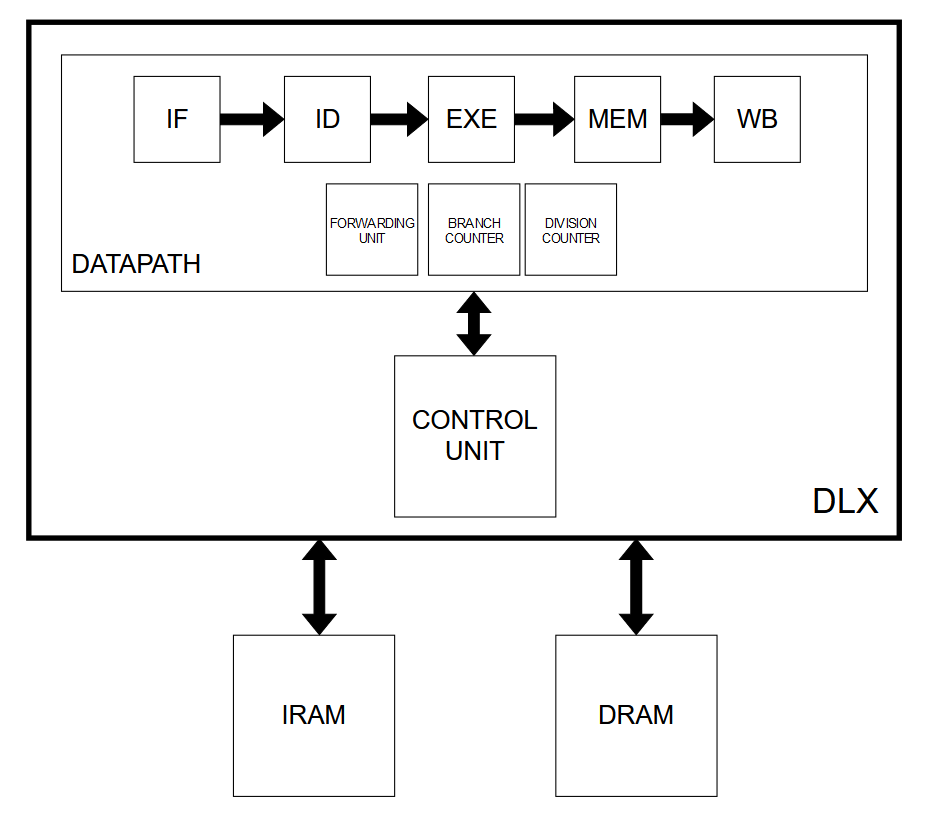

# DLX-MS2023
Repository for the DLX project developed for the Microelectronics Systems course at Polytechnic of Turin during 2023. The processor was not only designed but also synthesized and a physical layout was produced. An analysis of these last two steps is performed inside the provided [report](Documentation/Documentation.pdf).

## Contents 
- [Architecture overview](#architecture-overview)
- [Supported instructions](#supported-instructions)
- [Authors](#authors)

## Architecture overview
The core was designed around the basic properties of the DLX microprocessor. It supports the usage of two distinct memories for data (DRAM) and instruction fetching (IRAM) while also maintaining a Load/Store architecture. Thus, all operations are performed on register operands or immediate values, hardcoded inside the instruction itself. Reading and writing to the memory requires the usage of special instructions: load  (`lw`) and store (`sw`). This is to ensure more regularity between different operations and ease of decoding in order to increase the performances. The top level structure of the processor is:

To further increase the processor's throughput and to optimize its performances, some features were implemented:
- a **forwarding unit**, which allows instructions to avoid waiting for their operands to be committed in the register file before starting their execution;
- an **untaken branch policy**, which allows to avoid wasting clock cycles waiting for the condition of the branch to be evaluated;
- a **multiplier unit**, based on the Booth's algorithm, to perform signed multiplication on 64-bits;
- a **division unit**, based on a non-restoring algorithm, to perform signed division;
- an **extended ISA**;
- an almost fully **structural datapath**, to create more efficient designs, in terms of delay and area usages.

A more detailed explanation on how the CPU works can be found in the produced [report](Documentation/Documentation.pdf), together with the details and schematics of some of the components developed. Inside the `Documentation` folder, some schemes are also provided for better readability and can be opened by using the [Flowchart Maker web application](https://app.diagrams.net/).

## Supported instructions
A list of all the supported instructions of the DLX microprocessor can be found in the next sections, to easily allow realizing test programs for checking the CPU behaviour. All of them work on 32-bits values and produce 32-bits results. `RS1`, `RS2` refer to the source registers while `RD` refers to the destination register. Their index can vary between 0 and 31 (i.e. `r0`, `r1`, ..., `r31`). `#Imm` indicates a 16-bits or 26-bits value, depending on the instruction, that can be inserted by the programmer inside the instruction, using a decimal or hexadecimal notation (other notations may be supported, based on the compiler used). For some instructions, this immediate value is sign-extended, while for others it is zero-extended. This is the case of unsigned instructions, denoted with a `u` letter, and the logic functions.

Two registers are treated differently from the rest:
 - `r0` contains always the `0` value;
 - `r31` is used to contain the value of the return address after a `jal` instruction has been processed.

**NOTE**: Neither of these two rules have been forced at the hardware level but they need to be respected in order for the microprocessor to work.

A custom compiler is required to correctly translate some of the instructions supported by the architecture. The correct `OPCODE` and `FUNCT` field values can be found inside the [Globals](/Designs/globals.vhd) package (`/Designs/globals.vhd`).

### R-type instructions
| Operation | Description                                                                 | 
Example of usage 
 |
|-----------|-----------------------------------------------------------------------------|---------------------------------------------------|
| `add`     | Signed addition                                                             | `add RD, RS1, RS2`                                |
| `addu`    | Unsigned addition                                                           | `addu RD, RS1, RS2`                               |
| `sub`     | Signed subtraction                                                          | `sub RD, RS1, RS2`                                |
| `subu`    | Unsigned subtraction                                                        | `subu RD, RS1, RS2`                               |
| `and`     | Bitwise AND                                                                 | `and RD, RS1, RS2`                                |
| `nand`    | Bitwise NAND                                                                | `nand RD, RS1, RS2`                               |
| `or`      | Bitwise OR                                                                  | `or RD, RS1, RS2`                                 |
| `nor`     | Bitwise NOR                                                                 | `nor RD, RS1, RS2`                                |
| `xor`     | Bitwise XOR                                                                 | `xor RD, RS1, RS2`                                |
| `xnor`    | Bitwise XNOR                                                                | `xnor RD, RS1, RS2`                               |
| `sll`     | Logical left shift of A register (shift specified by B register)            | `sll RD, RS1, RS2`                                |
| `srl`     | Logical right shift of A register (shift specified by B register)           | `srl RD, RS1, RS2`                                |
| `sra`     | Arithmetic right shift of A register (shift specified by B register)        | `sra RD, RS1, RS2`                                |
| `sgt`     | Set DEST to one if A is greater than B                                      | `sgt RD, RS1, RS2`                                |
| `sgtu`    | Set DEST to one if A is greater than B (both A and B are unsigned)          | `sgtu RD, RS1, RS2`                               |
| `sge`     | Set DEST to one if A is greater or equal than B                             | `sge RD, RS1, RS2`                                |
| `sgeu`    | Set DEST to one if A is greater or equal than B (both A and B are unsigned) | `sgeu RD, RS1, RS2`                               |
| `seq`     | Set DEST to one if A is equal to B                                          | `seq RD, RS1, RS2`                                |
| `sne`     | Set DEST to one if A is not equal to B                                      | `sne RD, RS1, RS2`                                |
| `slt`     | Set DEST to one if A is lower than B                                        | `slt RD, RS1, RS2`                                |
| `sltu`    | Set DEST to one if A is lower than B (both A and B are unsigned)            | `sltu RD, RS1, RS2`                               |
| `sle`     | Set DEST to one if A is lower or equal to B                                 | `sle RD, RS1, RS2`                                |
| `sleu`    | Set DEST to one if A is lower or equal than B (both A and B are unsigned)   | `sleu RD, RS1, RS2`                               |
| `multlo`  | Signed multiplication (returns the lowest 32-bits of the result)            | `multlo RD, RS1, RS2`                             |
| `multhi`  | Signed multiplication (returns the highest 32-bits of the result)           | `multhi RD, RS1, RS2`                             |
| `div`     | Signed division                                                             | `div RD, RS1, RS2`                                |

### I-type instructions
Every unsigned operation, denoted with `u`, and all logic functions do not sign-extend the immediate field. Instead, they zero-extend it.

| Operation | Description                                                                   | 
Example of usage 
 |
|-----------|-------------------------------------------------------------------------------|---------------------------------------------------|
| `addi`    | Signed addition                                                               | `addi RD, RS1, #Imm`                              |
| `addui`   | Unsigned addition                                                             | `addui RD, RS1, #Imm`                             |
| `subi`    | Signed subtraction                                                            | `subi RD, RS1, #Imm`                              |
| `subui`   | Unsigned subtraction                                                          | `subui RD, RS1, #Imm`                             |
| `andi`    | Bitwise AND                                                                   | `andi RD, RS1, #Imm`                              |
| `nandi`   | Bitwise NAND                                                                  | `nandi RD, RS1, #Imm`                             |
| `ori`     | Bitwise OR                                                                    | `ori RD, RS1, #Imm`                               |
| `nori`    | Bitwise NOR                                                                   | `nori RD, RS1, #Imm`                              |
| `xori`    | Bitwise XOR                                                                   | `xori RD, RS1, #Imm`                              |
| `xnori`   | Bitwise XNOR                                                                  | `xnori RD, RS1, #Imm`                             |
| `slli`    | Logical left shift of A register (shift specified by an immediate value)      | `slli RD, RS1, #Imm`                              |
| `srli`    | Logical left shift of A register (shift specified by an immediate value)      | `srli RD, RS1, #Imm`                              |
| `srai`    | Arithmetic left shift of A register (shift specified by an immediate value)   | `srai RD, RS1, #Imm`                              |
| `sgti`    | Set DEST to one if A is greater than a sign-extended immediate value          | `sgti RD, RS1, #Imm`                              |
| `sgtui`   | Set DEST to one if A is greater than a zero-extended immediate value          | `sgtui RD, RS1, #Imm`                             |
| `sgei`    | Set DEST to one if A is greater or equal than a sign-extended immediate value | `sgei RD, RS1, #Imm`                              |
| `sgeui`   | Set DEST to one if A is greater or equal than a zero-extended immediate value | `sgeui RD, RS1, #Imm`                             |
| `seqi`    | Set DEST to one if A is equal to a sign-extended immediate value              | `seqi RD, RS1, #Imm`                              |
| `snei`    | Set DEST to one if A is not equal to a sign-extended immediate value          | `snei RD, RS1, #Imm`                              |
| `slti`    | Set DEST to one if A is lower than a sign-extended immediate value            | `slti RD, RS1, #Imm`                              |
| `sltui`   | Set DEST to one if A is lower than a zero-extended immediate value            | `sltui RD, RS1, #Imm`                             |
| `slei`    | Set DEST to one if A is lower or equal than a sign-extended immediate value   | `slei RD, RS1, #Imm`                              |
| `sleui`   | Set DEST to one if A is lower or equal than a zero-extended immediate value   | `sleui RD, RS1, #Imm`                             |
| `beqz`    | Branch to target instruction if operand is equal to 0                         | `beqz RD, #Target`                                |
| `multloi` | Signed multiplication (returns the lowest 32-bits of the result)              | `multloi RD, RS1, #Imm`                           |
| `multhii` | Signed multiplication (returns the highest 32-bits of the result)             | `multhii RD, RS1, #Imm`                           |
| `divi`    | Signed division                                                               | `divi RD, RS1, #Imm`                              |
| `lw`      | Load word from memory                                                         | `lw RD, #Imm(RS1)`                                |
| `sw`      | Store word to memory                                                          | `sw #Imm(RS1), RD`                                |
| `beqz`    | Branch to target instruction if operand is equal to 0                         | `beqz RD, #Target`                                |
| `bnez`    | Branch to target instruction if operand is not equal to 0                     | `bnez RD, #Target`                                |

### J-type instructions
| Operation | Type   | Description                                                                            | 
Example of usage 
 |
|-----------|--------|----------------------------------------------------------------------------------------|---------------------------------------------------|
| `j`       | Branch | Branch to target instruction                                                           | `j #Target`                                       |
| `jal`     | Branch | Branch to target instruction while saving the address of the next instruction in `r31` | `jal #Target`                                     |

## Authors
- [Matteo Isoldi](https://github.com/bOhYee)
- [Filippo Marostica](https://github.com/filippomarostica)
- [Elena Roncolino](https://github.com/elenaroncolino)